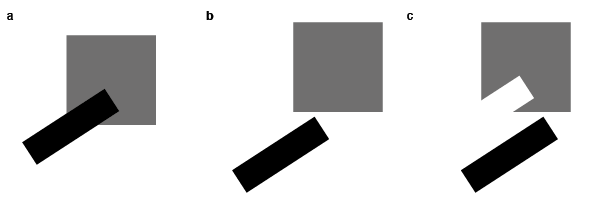

# Why studying perception?

>*In chapter 1, you will learn about an insight from robotics that perception is complicated (Moravec's Paradox). Moreover, we will look at the main reason why perception is hard (Poverty of the stimulus).*
   
## A very short review   

### What is perception?
For any field of research it is important to come up with a good definition. Contrary to the typical narrative flow of lectures, we will try to come up with the defining characteristics of perception only at the end of this course. At this point, I would rather like to spark your interest that there are many exciting — and actively explored — questions that we first need to think about before we find a good definition for perception. Questions such as what are the borders between perception and thinking? Can our thoughts influence how we perceive or is perception independent of that? Do we perceive the world as it is, or is it possible that we live in a big perceptual illusion? What are the goals of perception (e.g., providing veridical information/ news about the environment)? The good thing is, we can already learn an incredible amount of interesting things about perception without having finally settled on some of these basic questions. So, instead of giving you a definition, I want to formulate an invitation to think about what constitutes perception throughout this course.

### What is easy and what is hard?
Most of us have a wrong intuition about our own brain skills. Tyically, we underestimate how complex a seemingly easy task is. This problem becomes more obvious once we aim to build certain abilities like thinking, speaking, moving or perceiving in an artificial system like robot. Before you read any further, think for yourself about what is likely to be a hard task for a robot. Over the years, scientists were convinced that understanding how humans play chess is the most challenging task. Once we can build a robot that play chess, all other tasks would be easy to solve. This assumption turned out to be completely wrong, which brings us directly to Moravec's paradox. This paradox states that high-level thinking often actually requires very little computation (i.e., is easy to solve). Low-level sensorimotor skills, however, require enormous computational resources (i.e., is tough so build). Thus, what humans perceive as a hard problem is easy for a robot, and what we perceive as easy is very hard for robots. Today, you can easily buy a cheap chess computer against which even the best grandmasters lose, but there are no robots that can compete with the visual and motor abilities of young children. Thus, a complementary research approach of empirical investigation with experiments (analytic approach) and the implementation in computational systems like robots (synthetic approach) is particularly promising to reach a better understanding of brain functions. As Richard Feynman famoulsy put it in his quote "What I cannot build. I do not understand". 

### What is the main challenge?
You've just learned that perceiving is effortless for you, but in fact it is a complex task to generate perception. Many neurons in the brain are involved in constructing perception. But why are there so many neurons for perception? What is the problem that these many neurons try to solve? Well, here it is as expressed for vision:

```
There are infinite possible interpretations of the image falling   
onto the back of your eye (i.e., the retinal image).
```

This challenge is so fundamental to the vision sciences, that it got its own name — the poverty of the stimulus problem. It means that the retinal image (i.e., the stimulus) does not provide sufficient information (i.e, the poverty) to allow a single, unambigous interpretation. Sometimes you will read that a problem is under-constrained, or ill-posed, which basically means the same as above. Please note, there is one school of thought — ecological perception — that rejects the idea of a poor visual stimulus. They have some good arguments, but their way of thinking about vision is not really main-stream. For now, we will stick with the idea of ill-posed problems in vision, but keep in mind that vision scientists still argue whether the retinal image is sufficient or insufficient to enable (direct) perception.

Scientists and artists have created tons of examples to demonstrate that multiple (actually infinite) interpretations based on an input are possible (see one example in the Figure below). While these examples may seem artificial, for your visual system the poverty of the stimulus problem concerns any retinal image at any point in time [An ecological psychologist would probably say, these are still very artificial‚].



The problem is particularly obvious when it comes to 3D-vision. We construct a perception of a three-dimensional world based on a two-dimensional retinal image. This three-dimensional world is not present in the retinal image, and must be inferred. We will hear more about this once we address depth perception in a later session. 

[Add here example of a Necker cube. Mention accidental viewpoints. Insert gif with moving camera that solves accidental view point problem].

But surprisingly, it seems that we all perceive pretty much the same things around us. This is truley remarkable. Imagine you assign a group of people (across all ages from babies to elderly) a simple math task (let's say what is 100 - 37) that requires some computation/inference. It is reasonable to expect that an average person should be able to solve that easy task. It is also reasonable to expect that quite some people will arrive at a wrong result (nobody is perfect and some people are simply not good in math). Moreover, you don't expect young children, that never got in touch with numbers >10, or all elderly to give the correct answer. So, once you are done collecting the answers of particpants, you will notice a certain distribution of reported results (distributed with some variance around the true result of 63). Vision, in contrast, has to solve an incredibly harder problem and still all our brains seem to arrive at the same conclusion. Impressive, right? This points to rules (or mechanisms) that are hard-wired in the brain and work very reliably. It is vision scientists' goal to identify such **rules of vision**. This endevear is highly interdisciplinary and includes methods from psychology, neuroscience, medicine, computer science, robotics, physics, mathematics, and philosophy. We will touch upon methods from all these fields and see how they tell us something about perception.

## Excercises for next week
For next week, I would like to ask you to think about, and answer) the following three questions. Each answer should have about 150 words

- What do you think are the goals of perception? (150 words)
- Can you think of something where (and why) understanding perception really helps? (150 words)
- Can you think other another example where Moravec's paradox applies? (150 words)

## Further material
- Moravec's Paradox and vaccination
- Gibson's ecological perspective