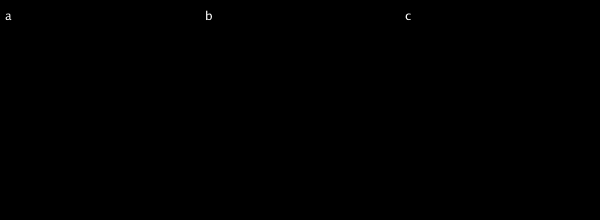

# Of neurons and maps

>*In this chapter we will briefly introduce **neurons**, the brain's most basic processing unit. Neurons during early perceptual processing have an interesting property—they are organized in **sensory maps**.*

## A very short review

Our current understanding of perception builds on complementary research traditions and one of them is the **neurophysiological approach**. It is an intuitive approach that resembles a reverse engineering logic, which I will briefly illustrate in an example. Imagine you found an old television system that you parents' place and you would like to understand how it works. You unscrew the box which will reveal many assembled parts that you don't really understand. But you also see a cable that is attached to the TV's start button. You check where the cable goes and you see how it is connected to another part. You might wonder what the function of this new part is. You could test the role of this part by carefully removing it. Once you have a better idea how the initial parts work you could start looking at where the cables lead away from this part. The neurophysiological approach is very similar to that strategy. A good starting point to understand the visual system is to study the first cells in the retina and how they are connected to other cells. Alternatively, you could start at the level of the retina where output is generated and sent to the brain. Over the years you can build up the complexity of the system that you study by increasing the number of steps (e.g., number of neurons) that you moved away from the retina. Obviously, it is a lot of work, but this approach (which I presented heavily oversimplified) has provided many important insights into the functioning of the sensory brain. (But there is also a critical meta view on this approach if we will ever come to an understanding of a system using these methods. See some of the highlighted additional readings). Now, it is necessary to briefly introduce neurons because the activity of single neurons in response to particular stimuli has revealed stunning insights into the functioning of the sensory processing in the brain. For the purposes of this course it will be sufficient to explain neurons in a pretty short and abstract way.

### Neurons

A neuron is the basic computational unit in the brain. Its function can be summarized as receiving input and generating output. Neurons receive input in the dendrites, and if the input exceeds a threshold they will generate an output (i.e., an action potential). The action potential travels along the axon to pass on a signal to the next neurons. A neuron can receive from and send output to many other neurons. If an action potential is generated, the neuron is *firing*. Importantly, there are two ways for a neuron to affect the firing of another neuron — **excitation** and **inhibition**. If the forwarded signal increases the chances for the other neuron to generate an action potential we call this an excitatory input. Neurons, however, can also decrease the likelihood for the next neuron to fire, which we call an inhibitory input. The link between two particular neurons is either excitatory or inhibitory.


- Abstract neurons and abstract neural networks.
- There are so and so many neurons in the brain which is a pretty abstract number.
- Here I show you an example of a simple neural network that can solve a particular task with x neurons.

Understanting the orchestrated behavior of neurons is crucial to understand any function of the brain. What is particularly interesting for perception is the following.

```
Neurons are organized in maps during early sensory processing. 
```

So, next we will take a look at sensory maps and what is interesting about maps in general.

### Sensory maps
It would not be surprising if the study of perception (and cognition) had its early roots in cartography rather than physics or philosophy. Maps play an outstanding role in all sensory modalities as they did throughout human history. More generally speaking, making a map means there is some external world property and we would like to map it onto some structure. The external property could be the stars in the sky, that is mapped onto some stone. We will look at some maps in this chapter and learn more about properties of maps. When studying perception we typically do not make new maps. Rather we attempt to understand what properites of the world are represented in a sensory map and what consquences follow from a particular mapping. 

- Introduce topographic maps and provide examples for vision and another modality. The key point in vision is that neighboring points on the retina are also neighbors in sensory maps.

### Properties of maps
- A map is the result from mapping someting onto something. Or in other words, mapping is the process of applying a mathematical function. We will therefore take a look at the discipline within mathematics that deals with mapping space—topology.

- Use now an example of a real map to explain some properties:
- continuous
- domain vs. codomain
- linear vs. nonlinear
- direction of mapping
- adding more dimensions to the map (foreshadow packing problem).

- Ok, we know there are maps. What's the benefit of maps.

- All kinds of map charaxcteristics (see Seeing book; continuous maps etc.)
- Benefits of maps (see Tics review)
- Topology
- The packing problem in general

## Excercises for next week

1.    Often it is very useful to see a graphical representation of a stimulus presented in the external world (e.g., an object on a computer screen) in addition to the neuron's activity. In the figure below, is such an example of a graphical visualization. Imagine a bright disk is presented on dark background. We are interested in two things. First, when is the stimulus presented (presented on the x-axis) and second, how bright was the stimulus (presented on the y-axis). In panel a, we see a continuous increase of the stimulus intensity in the time range 0 — 2 seconds after trial onset until the stimulus is maximally bright (i.e., the stimulus is white). Once the stimulus reached its maximal intensity it is suddenly removed. In panel b, we see a sudden onset of the stimulus, with maximal intensity, after 1 second and a sudden offset one second later. In panel c, the stimulus has the same temporal parameters as before, but the stimulus intensity is just half of the previous example (i.e., the the intensity reaches just 0.5 of the intensity represented on the y-axis).


Take a minute for yourself and try to visualize with your inner eyes how you imagine the three different stimuli to look like. If you have an idea, then click below to see the solution.

<details>
  <summary>Click to see solution!</summary>
  


</details>

2.    Please create a graphical visualization for the stimulus (intensity on y-axis, time on x-axis), for the following example.


3.    Please create **one** graphical visualization for the two stimuli in this example (intensity on y-axis, time on x-axis).


4.    Imagine you record the firing of a neuron (occurrence of action potential on y-axis, time on x-axis) for the last stimulus (in excercise 3). Please visualize the firings for a neuron that only fires in response to: 
    **a** "red", **b** "squares", and **c** "white OR squares".

5.    Display three pairs (external world, maps) and name correct map properties. (google maps, topology example, etc)
  -- continuous vs discontinuous
  -- linear vs. non-linear
  -- one-directional vs. bi-directional
  -- iso-metric, area pre-serving

6.    Display three maps and say how many properties/dimensions are in this map (country + income, )
  - 2,3,4 dimensional maps

7.    Display external worlds and ask them to map it onto the map
  - 1 dimensional problem on 1 dimension
  - 2 dimensional problem on 2 dimensions
  - 2 dimensional problem on 1 dimenions
  - 3 dimensional problem on 2 dimenions
  
8.    Think about four dimensional problem and how to map it onto a (multiple) plane and write the solution.
  
  
(U-Bahn, Tasse, dis-continuous map)
- Based on the 2,3,4 dimensional maps anticipate the packing problem. Let the students think about several solutions how one can pack 3 dimensions onto a plane.
- Find online a map with an interesting story and make a short video that introduces your map (about 2 min).

## Additional reading
- Maybe theatlantic article.
- Could a biologist understand a transistor
- Upload excercises as pdf version.