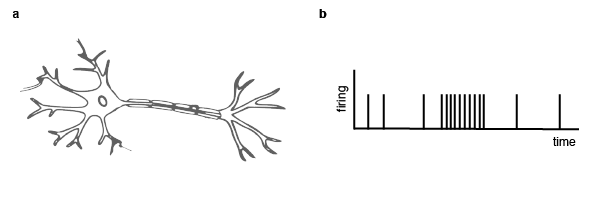

# Of neurons and maps

>*In this chapter we will briefly introduce **neurons**, the brain's most basic processing unit. Neurons during early perceptual processing have an interesting property—they are organized in **sensory maps**.*

## A very short review

Our current understanding of perception builds on complementary research traditions and one of them is the **neurophysiological approach**. It is an intuitive and easily accessible method of approaching perception that resembles a reverse engineering logic, which I will briefly illustrate with an example. Imagine you want to understand how an old television system that you found at home works. You unscrew the box of the device which will reveal many assembled parts that you don't really understand. But you also see a cable that is connected to the start button of the TV. You follow the cable and see it is connected to another part. You might wonder what the function of this new part is — and maybe you wonder what happens to your device once you remove that part. After years of detailed research, after you think you understand what this part is doing, you could start looking at where the cables lead away from this part. The neurophysiological approach is very similar to that strategy. A good starting point to understand the visual system is to start with the first cells in the retina and how they are connected to other cells. Alternatively, you could start at the level of the retina where output is generated and sent to the brain. Over the years you can build up the complexity of the system that you study by increasing the number of steps (e.g., number of neurons) that you moved away from the retina. Obviously, it is a lot of work, but this approach (which I presented heavily oversimplified) has provided many important insights into the functioning of the sensory brain. (But there is also a critical meta view on this approach if we will ever come to an understanding of a system using these methods. See some of the additional readings). It is necessary to briefly introduce neurons because the activity of single neurons in response to particular stimuli has revealed stunning insights into the functioning of sensory processing in the brain. Fortunately, for the purposes of this course, it will be sufficient to explain neurons in a pretty short and abstract way.

### Neurons

A neuron is the basic computational unit in the brain. Its basic function can be summarized as receiving input and generating output. Neurons receive input in the dendrites, and if the input exceeds a threshold they will generate an output (i.e., an action potential). The action potential travels along the axon to pass on a signal to the next neurons. A neuron can receive from and send output to many other neurons. If an action potential is generated, the neuron is *firing*. Importantly, there are two ways for a neuron to affect the firing of another neuron — **excitation** and **inhibition**. If the forwarded signal increases the chances for the other neuron to generate an action potential we call this an excitatory input. Neurons, however, can also decrease the likelihood for the next neuron to fire, which we call an inhibitory input. The link between two particular neurons is either excitatory or inhibitory.



- Abstract neurons and abstract neural networks.
- There are so and so many neurons in the brain which is a pretty abstract number.
- Here I show you an example of a simple neural network that can solve a particular task with x neurons.

```
Neurons are organized in maps during early sensory processing. 
```
### Sensory maps
It would not be surprising if the study of perception (and cognition) had its early roots in cartography rather than physics or philosophy. Maps play an outstanding role in all sensory modalities as they did throughout human history. More generally speaking, making a map means there is some external world property and we would like to map it onto some structure. The external property could be the stars in the sky, that is mapped onto some stone. We will look at some maps in this chapter and learn more about properties of maps. When studying perception we typically do not make new maps. Rather we attempt to understand what properites of the world are represented in a sensory map and what consquences follow from a particular mapping. 

- Introduce topographic maps and provide examples for vision and another modality. The key point in vision is that neighboring points on the retina are also neighbors in sensory maps.

### Properties of maps
- A map is the result from mapping someting onto something. Or in other words, mapping is the process of applying a mathematical function. We will therefore take a look at the discipline within mathematics that deals with mapping space—topology.

- Use now an example of a real map to explain some properties:
- continuous
- domain vs. codomain
- linear vs. nonlinear
- direction of mapping
- adding more dimensions to the map (foreshadow packing problem).

- Ok, we know there are maps. What's the benefit of maps.

- All kinds of map charaxcteristics (see Seeing book; continuous maps etc.)
- Benefits of maps (see Tics review)
- Topology
- The packing problem in general

## Excercises for next week
- Display three maps and name correct map properties.
continuous vs discontinuous
linear vs. non-linear
one-directional vs. bi-directional
2,3,4 dimensional maps

-> provide hidden solutions.

(U-Bahn, Tasse, dis-continuous map)
- Based on the 2,3,4 dimensional maps anticipate the packing problem. Let the students think about several solutions how one can pack 3 dimensions onto a plane.
- Find online a map with an interesting story and make a short video that introduces your map (about 2 min).

## Additional reading
- Maybe theatlantic article.